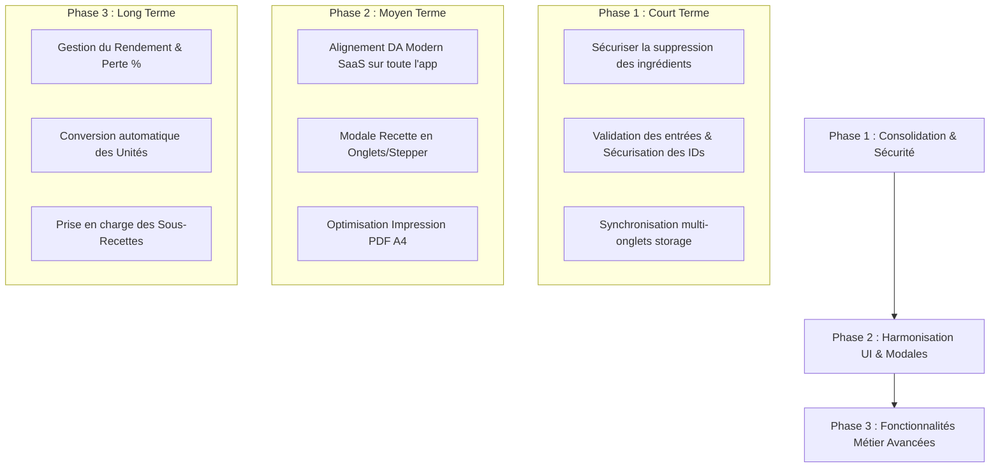

# 🗺️ Rapport d'Expertise, Audit et Feuille de Route du Projet
## Application de Gestion Culinaire (100% Front-End / Statique / GitHub Pages)

*Document rédigé à l'attention du développeur pour guider l'évolution, la consolidation technique et l'amélioration de la présentation de l'application.*

---

## 📋 Sommaire
1. [ Vision et Positionnement du Projet](#1--vision-et-positionnement-du-projet)
2. [ 🔍 Audit Technique : Fragilités du Code & Intégrité des Données](#2--audit-technique--fragilités-du-code--intégrité-des-données)
3. [ 🎨 Audit UI/UX : Présentation, Ergonomie & Design System](#3--audit-uiux--présentation-ergonomie--design-system)
4. [ 🍳 Lacunes Fonctionnelles Métier (Ce qu'il manque pour les chefs)](#4--lacunes-fonctionnelles-métier-ce-quil-manque-pour-les-chefs)
5. [ 🚀 Feuille de Route & Plan d'Action Étape par Étape](#5--feuille-de-route--plan-daction-étape-par-étape)

---

## 1. 🎯 Vision et Positionnement du Projet

### Les Forces Majeures de l'Application
- **Architecture 100% Client (Front-End Pure) :** Fonctionnement autonome sans aucun backend serveur ni base de données payante. Hébergement gratuit et rapide sur **GitHub Pages**.
- **Indépendance & Respect des Données :** Les données restent la propriété de l'utilisateur (stockées dans le `localStorage` du navigateur) avec possibilité d'import/export complet au format JSON.
- **Logique Financière Rigoureuse (Prime Cost SAS) :** L'intégration de la main d'œuvre chargée (22,00 €/h), des frais généraux (10%) et des marges nettes réelles apporte une vraie valeur métier par rapport aux simples calculs de "Food Cost".
- **Calculs Dynamiques en Temps Réel :** Réactivité exemplaire grâce aux modules ES6 (`data.js`, `recettes.js`, `bon-economat.js`).

---

## 2. 🔍 Audit Technique : Fragilités du Code & Intégrité des Données

Bien que l'application soit fonctionnelle, l'analyse du code source répertorie plusieurs points de fragilité technique qu'il convient de consolider :

### ⚠️ A. Intégrité Référentielle & Suppression d'Ingrédients (Risque Majeur)
- **Le problème :** Dans `mercuriale.js`, si l'utilisateur supprime une denrée de la Mercuriale alors qu'elle est utilisée dans 3 recettes, l'ingrédient disparaît du tableau de la Mercuriale. 
- **La conséquence :** Dans `data.js` (`calculateRecipeCost`), l'ingrédient n'est plus trouvé (`getIngredientById` renvoie `undefined`). La recette affiche des coûts tronqués ou incomplets sans avertir explicitement l'utilisateur, ce qui fausse les marges.
- **Solution recommandée :**
  1. Implémenter un **contrôle d'impact** avant suppression dans `mercuriale.js` : Bloquer la suppression si l'ingrédient est présent dans au moins une recette.
  2. Proposer une modale permettant d'**intervertir/remplacer** l'ingrédient supprimé par une autre denrée existante dans les recettes impactées.

### 🔢 B. Génération des Identifiants Unique (`nextRecipeId` / `nextIngredientId`)
- **Le problème :** Dans `data.js`, les fonctions `nextRecipeId()` et `nextIngredientId()` utilisent `Math.max(...recipes.map(r => r.id)) + 1`.
- **La conséquence :** 
  - Si le tableau `recipes` est vide (`[]`), `Math.max()` renvoie `-Infinity`.
  - Si un import JSON externe contient des IDs sous forme de chaînes de caractères (ex: `"12"`), des concaténations accidentelles (`"121"`) ou des erreurs peuvent survenir.
- **Solution recommandée :** Sécuriser le générateur d'IDs avec une vérification de la longueur du tableau et un parsing explicite :
  ```javascript
  export function nextRecipeId() {
    if (!Array.isArray(recipes) || recipes.length === 0) return 1;
    const maxId = recipes.reduce((max, r) => Math.max(max, parseInt(r.id) || 0), 0);
    return maxId + 1;
  }
  ```

### 🧮 C. Saisie d'Entrées Invalides & Division par Zéro (Calculs Financiers)
- **Le problème :** Si l'utilisateur saisit un nombre de portions égal à `0`, un multiplicateur nul ou un temps de production négatif dans une recette :
  - `calculateTotalCostPerServing()` effectue une division par zero (`Infinity`).
  - `calculateNetMargin()` génère des valeurs `NaN` ou des pourcentages aberrants.
- **Solution recommandée :**
  - Appliquer des attributs HTML5 stricts : `min="1"`, `step="1"` sur le champ portions, et `min="0.1"` sur le multiplicateur.
  - Sécuriser les fonctions de calcul dans `data.js` avec des valeurs garde-fous (ex: `if (servings <= 0) return 0;`).

### 🔄 D. Absence de Synchronisation Multi-Onglets
- **Le problème :** Si l'utilisateur ouvre l'application dans deux onglets côte à côte (ex: Mercuriale sur l'onglet 1 et Recettes sur l'onglet 2), la modification d'un prix d'ingrédient sur l'onglet 1 n'est pas répercutée instantanément sur l'onglet 2.
- **Solution recommandée :** Ajouter un écouteur d'événement global dans `app.js` sur l'événement navigateur `storage` :
  ```javascript
  window.addEventListener('storage', (e) => {
    if (e.key === 'culinary-mercuriale' || e.key === 'culinary-recipes') {
      loadData();
      // Rafraîchir dynamiquement l'affichage de la page courante sans recharger
    }
  });
  ```

### 📦 E. Versioning & Migration des Données JSON
- **Le problème :** En cas d'évolution future de la structure de données (ajout de nouvelles propriétés comme `pertePourcentage`, `fournisseur`, `categorie`), les sauvegardes JSON ou les `localStorage` existants des utilisateurs ne contiendront pas ces champs.
- **Solution recommandée :** Intégrer un numéro de version (`version: "1.1"`) dans les exports JSON et créer une fonction `migrateData(data)` dans `data.js` pour initialiser avec des valeurs par défaut les champs manquants lors de l'import.

---

## 3. 🎨 Audit UI/UX : Présentation, Ergonomie & Design System

### 💎 A. Harmonisation de la Direction Artistique (DA)
- **Constat :** La page **Bon d'Économat** possède désormais un design "Modern SaaS" très soigné (cartes KPI à fort contraste, typographie Outfit/Inter, pastilles de couleur, ombres douces). En comparaison, la page **Mercuriale** et le **Tableau de Bord** présentent un style légèrement plus sobre ou ancien.
- **Action corrective :** Étendre les composants et classes CSS du Bon d'Économat (`.stat-card`, `.badge`, `.table-modern`) à **toutes** les pages de l'application.

### 📝 B. Ergonomie de la Modale de Création / Édition de Recette
- **Constat :** La modale d'édition de recette (`#recipe-modal` dans `recettes.html`) affiche tous les éléments sur une seule longue colonne défilante (Informations générales, Liste des ingrédients, Étapes de préparation, Résumé financier).
- **Action corrective :** Structurer la modale en **Onglets interactifs** ou en **Étapes (Stepper)** :
  - **Onglet 1 :** Informations générales & Temps de travail
  - **Onglet 2 :** Ingrédients & Nomenclature (avec recherche rapide d'ingrédients)
  - **Onglet 3 :** Étapes de préparation & Notes
  - **Onglet 4 :** Synthèse financière & Rentabilité Prime Cost

### 📱 C. Responsivité sur Écran Mobile (< 768px)
- **Constat :** Les tableaux à 10-12 colonnes (`recettes.html` et `mercuriale.html`) provoquent un défilement horizontal important sur smartphone, rendant la saisie malaisée.
- **Action corrective :** Ajouter un mode d'affichage alternatif en **Cartes Mobiles (Mobile Card View)** sur écran étroit (`@media (max-width: 768px)`), permettant de consulter chaque recette ou ingrédient sous forme de carte verticale repliable.

### 🖨️ D. Impression et Export PDF
- **Constat :** Le bouton d'impression s'appuie sur `window.print()`. L'alignement dépend fortement de la configuration de l'imprimante ou du navigateur de l'utilisateur.
- **Action corrective :** Optimiser les règles CSS `@media print` dans `style.css` (masquer le header, les boutons d'action, forcer le fond blanc et les marges A4 propres) ou intégrer la bibliothèque légère client-side `html2pdf.js` pour garantir un fichier `.pdf` standardisé en 1 clic.

---

## 4. 🍳 Lacunes Fonctionnelles Métier (Ce qu'il manque pour les chefs)

Pour transformer cette application d'un outil de démonstration en une référence incontournable pour les professionnels de la restauration, voici les fonctionnalités métier clés à ajouter :

### 1. Rendement et Perte à la Découpe (Yield Loss % / Coefficient de Parage)
- **Explication :** En cuisine, 1 kg de carottes brutes achetées donne environ 800 g de carottes épluchées (20% de perte). Le coût matière réel doit être calculé sur le produit net.
- **Implémentation :** Ajouter un champ optionnel `yield` (%) dans la Mercuriale (défaut : 100%).
  $$\text{Coût Net/g} = \frac{\text{Prix d'achat/g}}{\text{Rendement (\%) / 100}}$$

### 2. Conversion d'Unités Automatique (kg ↔ g, L ↔ cl ↔ ml)
- **Explication :** Actuellement, l'utilisateur doit faire correspondre manuellement l'unité d'achat et l'unité d'utilisation.
- **Implémentation :** Ajouter une table de conversion automatique dans `common.js` pour permettre d'acheter au **kg** à `14,00 €/kg` et d'utiliser **250 g** dans la recette sans calcul manuel.

### 3. Sous-Recettes / Preparations de Base (Recettes Imbriquées)
- **Explication :** Une recette de lasagnes utilise une "Sauce tomate maison" et une "Sauce béchamel". 
- **Implémentation :** Permettre d'insérer une **Recette existante** comme un composant/ingrédient dans une autre recette (Nomenclature à N niveaux).

### 4. Fournisseurs et Conditionnements d'Achat
- **Explication :** Un ingrédient est acheté chez un fournisseur précis (ex: METRO, Transgourmet) sous un conditionnement donné (ex: Sac de 25 kg à 30,00 €).
- **Implémentation :** Ajouter les champs `fournisseur`, `conditionnement` et `prixConditionnement` dans la Mercuriale.

### 5. Export / Sauvegarde Automatique Locale
- **Explication :** Éviter toute perte de données si l'utilisateur vide son cache de navigateur.
- **Implémentation :** Proposer un rappel de sauvegarde JSON si aucune sauvegarde n'a été effectuée depuis plus de 7 jours, ou stocker un historique de 3 sauvegardes automatiques dans `localStorage`.

---

## 5. 🚀 Feuille de Route & Plan d'Action Étape par Étape

Voici le découpage recommandé pour guider les prochains développements sans complexifier inutilement le projet :



### 📅 Plan d'Exécution Recommandé

#### 🔨 Phase 1 : Consolidation & Sécurité du Code (Prochaine Étape)
1. **Intégrité référentielle :** Ajouter le contrôle d'utilisation des ingrédients avant suppression dans `mercuriale.js`.
2. **Robustesse calculs :** Corriger la génération des IDs (`nextRecipeId`, `nextIngredientId`) et sécuriser les fonctions de calcul contre les valeurs nuls ou négatives.
3. **Synchronisation :** Ajouter l'écouteur `storage` dans `app.js`.

#### 🎨 Phase 2 : Refonte Visuelle & Expérience Utilisateur
1. **Modale Recette :** Transformer le formulaire de création/édition de recette en interface à onglets (Général, Composition, Marges).
2. **Cartes Mobiles :** Développer le style CSS/HTML pour l'affichage réactif sur smartphone.
3. **Mise en page Impression :** Peaufiner les styles d'impression pour des fiches techniques A4 impeccables.

#### 🌟 Phase 3 : Enrichissement Métier
1. **Module de Conversion d'Unités :** Gérer automatiquement les équivalences de masses et volumes.
2. **Rendement & Pertes :** Intégrer le calcul de coût net après parage.
3. **Sous-Recettes :** Permettre l'imbrication des fiches techniques.

---

### 💡 Conclusion
Le projet repose sur de très solides fondations : une architecture **100% autonome, rapide, sans coût d'infrastructure et facile à maintenir sur GitHub Pages**. En appliquant les corrections de sécurité de la Phase 1 et l'harmonisation visuelle de la Phase 2, l'application atteindra un niveau de finition et de fiabilité digne d'un logiciel SaaS professionnel.
